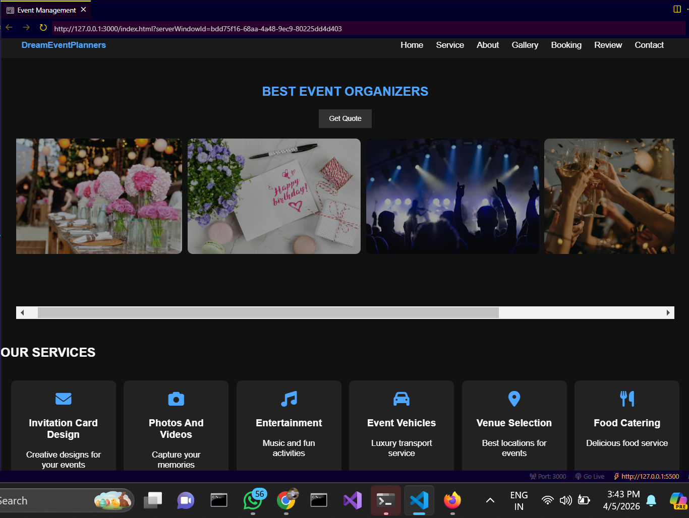
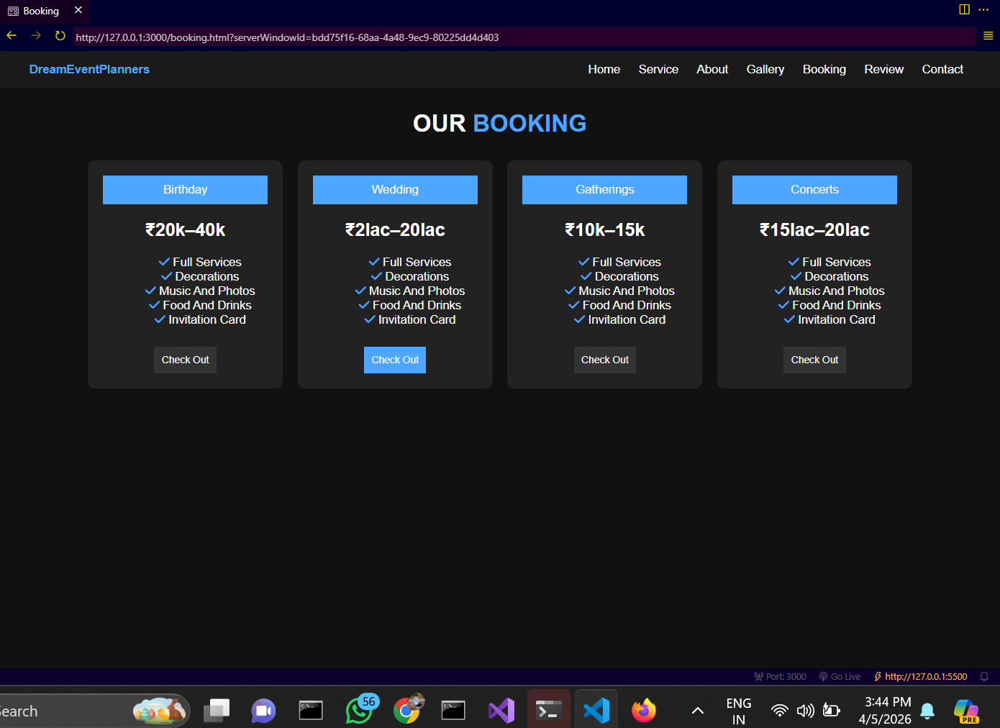
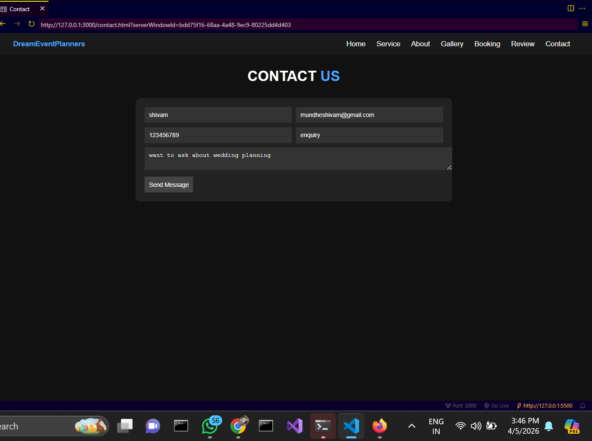

# Event Management System (Web Interface)

## Research Paper

Event Management System – IJNRD Journal

##  Objective

To design event management syestem web interface pages based on previous research paper outputs using HTML and CSS.

## Features

* Home Page (Event Services)
* Booking Page (Pricing Plans)
* Contact Page (User Form)

## Technologies Used

* HTML
* CSS
* JavaScript

##  Screenshots

### Home Page

### Booking Page

### Contact Page

